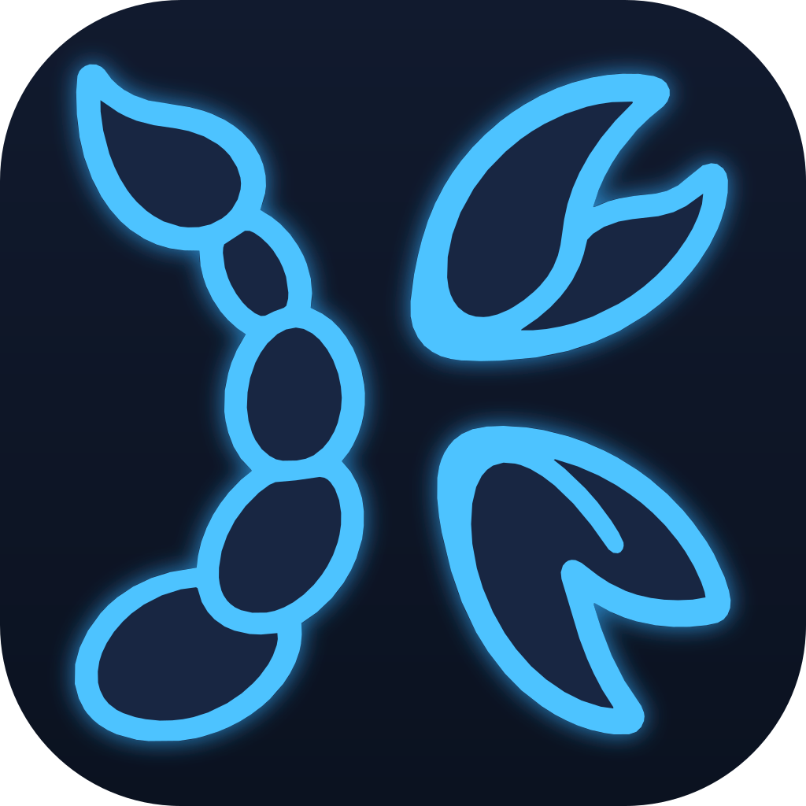

<div align="center">



# kxbuild

**English** · [简体中文](README_zh.md)

**Build iOS apps from the command line on Windows, Linux and macOS**

kxbuild is a build system for Xcode projects, in the role xcodebuild plays on a Mac.<br/>
It reads .xcodeproj / .xcworkspace / Package.swift as they are, accepts xcodebuild's own command-line syntax,<br/>
and produces signed .ipa files ready for the App Store. Runs on Windows, Linux and macOS. No Xcode required.

<br/>


[Install](#-install) · [Project types](#-supported-project-types) · [Issues](../../issues)

</div>

## ✨ Highlights

| | |
|---|---|
| 🖥️ **Cross-platform** | Builds natively on Windows, Linux and macOS |
| 📂 **No project changes** | Build settings, schemes, target dependencies and compiler flags are read by Xcode's rules |
| 🔧 **xcodebuild compatible** | Ships drop-in `xcodebuild`, `xcrun` and `codesign`, so framework build scripts run unchanged |
| 🔏 **Signing built in** | Drop your .p12 and .mobileprovision into a `keychain` folder and every build signs automatically |
| 📦 **One command to .ipa** | A Release build writes an App Store-ready .ipa, including SwiftSupport and the Transporter asset description |
| 📱 **Install on device** | `--install` builds, signs and installs on a USB-connected iPhone in one step |
| 🤖 **Script and CI friendly** | `--json` prints one JSON event per line, and exit codes follow the usual 0 / non-zero rule |
| ✍️ **Any editor** | Use it from a terminal, a CI pipeline, or whichever editor you like. Nothing to configure in the project |

## 🖥️ Supported Platforms

| OS | Version | Build | Sign | Install on iPhone |
|:---:|:---:|:---:|:---:|:---:|
|  **Windows** | Windows 10 / 11 (WSL recommended) | ✅ | ✅ | ✅ |
|  **Linux** | Major distros / WSL | ✅ | ✅ | ✅ |
|  **macOS** | macOS | ✅ | ✅ | ✅ |

## 🧱 Supported Project Types

Each guide shows how to prepare and build that kind of project with the `kxbuild` command line.

| Project type | Guide |
|---|---|
|  **Swift / SwiftUI / UIKit** and **Swift packages** | [doc/en/swift.md](doc/en/swift.md) |
|  **Objective-C** (and mixed Objective-C / Swift) | [doc/en/objective-c.md](doc/en/objective-c.md) |
|  **CocoaPods** | [doc/en/cocoapods.md](doc/en/cocoapods.md) |
|  **Flutter** | [doc/en/flutter.md](doc/en/flutter.md) |
|  **React Native** | [doc/en/react-native.md](doc/en/react-native.md) |
|  **Expo** | [doc/en/expo.md](doc/en/expo.md) |
| 🟢 **uni-app (HBuilderX)** | [doc/en/uni-app.md](doc/en/uni-app.md) |
|  **Kotlin Multiplatform / Compose** | [doc/en/kotlin-multiplatform.md](doc/en/kotlin-multiplatform.md) |
|  **Unity** (exported Xcode project) | [doc/en/unity.md](doc/en/unity.md) |
|  **Godot** (exported Xcode project) | [doc/en/godot.md](doc/en/godot.md) |
|  **cocos2d-x** | [doc/en/cocos2d-x.md](doc/en/cocos2d-x.md) |
|  **Cordova** | [doc/en/cordova.md](doc/en/cordova.md) |

C and C++ sources inside any of these projects build as part of the project.

## 📥 Install

Run the command for your OS and follow the prompts.

**Linux / macOS / WSL**

```shell
curl -fsSL https://www.kxbuild.net/install.sh | bash
```

**Windows (PowerShell)**

```powershell
irm https://www.kxbuild.net/install.ps1 | iex
```

- The default install directory is `~/kxbuild` (`%USERPROFILE%\kxbuild` on Windows). The installer asks first, so you can enter another absolute path. It sets `KXBUILD_HOME` and adds its `bin` folder to `PATH`.
- On Windows, installing inside WSL (Ubuntu) is recommended. A native Windows install also sets up the Visual Studio C++ Build Tools (10–20 GB), and Windows' 260-character path limit can break builds of deeply nested projects.

Then open a **new** terminal and check the environment. You're ready when every check passes.

```shell
kxbuild doctor
```

To update later, run `kxbuild update`. It installs the newest kxbuild and then runs doctor.

## ⌨️ Quick Start

**1. Create a project** (skip this for an existing project)

```shell
kxbuild project create -t app_swiftui -n MyApp -b com.example.myapp -o D:\projects
```

`kxbuild project templates` lists all templates: SwiftUI, UIKit, Objective-C, CocoaPods, Flutter, React Native, Expo, frameworks and static libraries.

**2. Set up signing**

Put your .p12 certificate and .mobileprovision profile in a `keychain` folder in the project root, with a `password.properties` file. See [Signing](#-signing).

**3. Build and install on your iPhone**

Connect the iPhone over USB, tap *Trust This Computer*, and turn on Developer Mode (Settings → Privacy & Security → Developer Mode). Then:

```shell
kxbuild build D:\projects\MyApp\MyApp.xcodeproj --install
```

**4. Build a Release .ipa**

```shell
kxbuild build D:\projects\MyApp\MyApp.xcodeproj -c Release
```

The package is written to `build\MyApp.ipa` in the project folder. Upload it to App Store Connect with Transporter or any App Store upload tool; TestFlight and App Review work as usual.

## 🛠️ kxbuild Commands

| Command | What it does |
|---|---|
| `kxbuild doctor [project]` | Checks and fixes the build environment. With a project path, also prepares that project (Flutter, React Native, Expo, Kotlin Multiplatform and cocos2d-x need this before their first build) |
| `kxbuild build <project>` | Compiles, links, signs and packages an .xcodeproj, .xcworkspace or Package.swift folder, optionally installing it on a device |
| `kxbuild test <project>` | Builds a scheme's tests and runs them on a connected iOS 17+ device (XCTest and Swift Testing) |
| `kxbuild resolve <project>` | Resolves Swift package dependencies |
| `kxbuild project …` | Inspects, creates, edits and converts Xcode projects: `info`, `templates`, `create`, `settings`, `add-setting`, `add-package`, `add-target`, `add-folder`, `add-resource`, `localization`, `spm2app`, `to-spm` |
| `kxbuild config get/set/unset` | Reads or changes this machine's settings |
| `kxbuild update` | Updates kxbuild, then runs doctor |
| `kxbuild version` | Prints version information |

Every command accepts `--help` for its full list of options.

### `kxbuild build` options

```text
kxbuild build <project.xcodeproj|project.xcworkspace|package dir> [flags]
```

| Option | Description |
|---|---|
| `-s, --scheme NAME` / `-t, --target NAME` | Scheme or target to build. Without either, the default scheme is built |
| `-c, --config NAME` | Build configuration. Defaults to the scheme's, else Debug |
| `--sdk NAME`, `--arch ARCH`, `--toolchain NAME` | SDK (`iphoneos`, `iphonesimulator`, `macosx`), architecture and toolchain |
| `-D, --setting KEY=VALUE` | Overrides a build setting. Repeatable; same precedence as xcodebuild `KEY=VALUE` |
| `--xcconfig PATH` | Applies an .xcconfig file, like xcodebuild `-xcconfig` |
| `-o, --ipa PATH` / `--no-ipa` | Where to write the .ipa, or skip packaging |
| `-i, --install` | Installs the signed app on the connected iPhone after a successful build |
| `--derivedDataDir DIR`, `--clean` | Build output root (default `~/DerivedData`), and empty it before building |
| `--ignoreDependence` | Builds only the named targets, skipping their dependencies |
| `-j, --jobs N`, `--explain`, `--timing`, `-v, --verbose`, `--no-cache` | Parallelism and diagnostics |
| `--emit-commands-only` | Writes only `compile_commands.json` for editor code completion; nothing is compiled |
| `--skip-package-updates`, `--only-use-versions-from-resolved-file`, `--disable-package-repository-cache`, `--package-cache-path DIR` | Swift package resolution, matching the xcodebuild options of the same meaning |

### Build products

| Product | Location |
|---|---|
| .app and intermediates | `~/DerivedData/<Name>-<hash>/` (change with `--derivedDataDir`) |
| .ipa | `<project dir>/build/<App>.ipa` for Release, `<App>-<Config>.ipa` for other configurations |
| `<App>.AppStoreInfo.plist` | Next to a Release .ipa. The asset description for command-line Transporter's `-assetDescription` |

### Common recipes

| Goal | Command |
|---|---|
| Install a Debug build on the iPhone | `kxbuild build .\MyApp.xcodeproj --install` |
| Release .ipa for the App Store | `kxbuild build .\MyApp.xcodeproj -c Release` |
| Sign with a Distribution certificate chosen on the command line | `kxbuild build .\MyApp.xcodeproj -c Release -D CODE_SIGN_IDENTITY="Apple Distribution"` |
| Set version and build number for one build | `kxbuild build .\MyApp.xcodeproj -D MARKETING_VERSION=1.2.0 -D CURRENT_PROJECT_VERSION=45` |
| Check that it compiles, without signing | `kxbuild build .\MyApp.xcodeproj -D CODE_SIGNING_ALLOWED=NO` |
| Simulator SDK compile check | `kxbuild build .\MyApp.xcodeproj --sdk iphonesimulator -D CODE_SIGNING_ALLOWED=NO` |
| Build one library target only | `kxbuild build .\MyApp.xcodeproj -t MyKit --ignoreDependence` |
| Reset Swift package caches | `kxbuild resolve .\MyApp.xcworkspace --force` |
| List schemes, targets and bundle IDs | `kxbuild project info .\MyApp.xcodeproj` |

## 🔁 Scripts and CI

All commands exit with 0 on success and non-zero on failure. A typical CI command for a release .ipa:

```shell
kxbuild build MyApp.xcworkspace -s MyApp -c Release --clean --derivedDataDir ./out --skip-package-updates --ipa ./out/MyApp.ipa --json
```

With `--json`, every line on stdout is one JSON event (`log`, `progress`, `diagnostic`, and a final `result`):

```json
{"type":"progress","phase":"CompileSwiftSources","current":12,"total":42,"target":"MyApp"}
{"type":"result","command":"build","schemaVersion":1,"data":{"success":true,"duration":"1m12s","output":"…","products":["…"],"ipa":["out/MyApp.ipa"],"schemaVersion":1}}
```

Leave `--json` off when troubleshooting, because error details appear only in the normal output. Set `KXBUILD_NO_UPDATE_CHECK` to turn off update prompts in CI.

## 🔧 xcodebuild Compatibility

The `bin` folder of the install directory contains `xcodebuild`, `xcrun` and `codesign`, named the same as on macOS. When React Native, Expo, Flutter or Cordova scripts — or your own scripts — call them, they run kxbuild's versions, so they work unchanged. On macOS the system's own commands stay first on `PATH`, so use `kxbuild build` there.

```shell
xcodebuild -workspace ios/MyApp.xcworkspace -scheme MyApp -configuration Debug -sdk iphoneos
xcodebuild -list -json
xcodebuild -showBuildSettings -project MyApp.xcodeproj
xcrun --sdk iphoneos --show-sdk-path
```

| Supported | |
|---|---|
| Actions | `build` (default), `clean`, `install`, `installhdrs`, `installapi`, `installsrc`, `archive` (minimal, unsigned .xcarchive), `build-for-testing`, `test`, `test-without-building` (tests run on a connected iOS 17+ device) |
| Selection | `-project`, `-workspace`, `-scheme`, `-target`, `-alltargets`, `-configuration`, `-sdk`, `-arch`, `-toolchain`, `-destination` |
| Settings | `-xcconfig PATH`, `KEY=VALUE` |
| Output | `-derivedDataPath`, `-archivePath`, `-clonedSourcePackagesDirPath`, `-resolvePackageDependencies` |
| Queries | `-list`, `-showBuildSettings`, `-showsdks`, `-showdestinations`, `-version`, with `-json` |
| Control | `-jobs`, `-quiet`, `-verbose`, `-hideShellScriptEnvironment` |

Not supported: `analyze`, `docbuild`, `-exportArchive`, `-create-xcframework`, localization import/export and platform downloads. Other xcodebuild options are accepted and ignored. Exit codes follow xcodebuild: 64 usage error, 65 build failure or unsupported action, 66 input file not found. To produce an .ipa for distribution, use `kxbuild build -c Release`.

`xcrun` finds and runs SDK and toolchain tools (`--show-sdk-path`, `--show-sdk-version`, `-f TOOL`, `xcrun clang …`). `codesign` signs and verifies with the same options, output and exit codes as on macOS.

## 🔏 Signing

You need a .p12 certificate (with its private key) and a .mobileprovision profile from your Apple Developer account: Apple Development + a development profile containing your iPhone's UDID for testing, Apple Distribution + an App Store profile for release.

Put them in a `keychain` folder. The one in the project root applies to that project; the one under `KXBUILD_HOME` is shared by all projects. Both are merged, and on macOS the system keychain is used too.

```text
keychain/
├─ development.p12
├─ distribution.p12
├─ MyApp_Dev.mobileprovision
├─ MyApp_AppStore.mobileprovision
└─ password.properties
```

`password.properties` has one `file=password` line per certificate (file name exactly as on disk, no quotes):

```properties
development.p12=123456
distribution.p12=123456
```

As in Xcode, the project's signing settings decide which certificate and profile are used: `CODE_SIGN_IDENTITY`, `DEVELOPMENT_TEAM`, and either automatic matching by bundle ID and team or `PROVISIONING_PROFILE_SPECIFIER`. Override them for one build with `-D`. Without a certificate the project still builds, but the product is unsigned and won't install on an iPhone.

## 📱 Installing on a Device

kxbuild installs `kxdevice` alongside it for talking to iPhones over USB.

```shell
kxdevice setup                    # one-time: device drivers / usbmuxd
kxdevice device list              # first column is the UDID
kxbuild build .\MyApp.xcodeproj --install
kxdevice install .\build\MyApp.ipa
```

| OS | `kxdevice setup` |
|---|---|
| Windows | Starts the Apple Mobile Device Service, installing Apple Devices or iTunes first if needed (one admin approval) |
| WSL | Uses the Windows-side service through a relay. Plug the iPhone into Windows; don't pass it through with usbipd |
| Linux | Installs and starts usbmuxd and its udev rules (needs sudo) |
| macOS | Nothing to install |

With several devices connected, `--install` uses the first one; pass `--udid` to `kxdevice` to choose.

## ❓ FAQ

**Do I have to change my Xcode project?**

No. kxbuild reads the project files as they are, and the project still opens in Xcode as usual.

**Can the builds be published to the App Store?**

Yes. A Release build writes an .ipa with the layout App Store Connect expects. Upload `build/<App>.ipa` as is; TestFlight and App Review work as usual.

**`kxbuild: command not found` after installing**

Open a new terminal so the updated `PATH` takes effect. If it still fails, check that the `bin` folder of the install directory is on `PATH`.

**The build can't find headers or modules from Pods**

You built the .xcodeproj. Run `pod install`, then build the generated .xcworkspace.

**Debug build fails to link with `undefined symbol: …vpfi`**

A known issue in the open-source Swift compiler when compiling file by file. Set `KXBUILD_SWIFT_WHOLE_MODULE=all` (or pass `-D KXBUILD_SWIFT_WHOLE_MODULE=all` for one build) to build every Swift target as a whole module.

**`No signing certificate matching '…' found`**

The keychain folder has no certificate of the type or team the project asks for. Add the matching .p12, or use `-D CODE_SIGN_IDENTITY=… -D DEVELOPMENT_TEAM=…`.

**Something else fails**

Run `kxbuild doctor -v` (with the project path, if it's project-specific). It fixes most environment problems; its output is the most useful thing to include in a bug report.

## 📣 Feedback

<div align="center">

🐛 Found a problem or have a suggestion? [Open an Issue](../../issues/new)<br/>
Please include the output of `kxbuild version` and `kxbuild doctor -v`, plus the full log of the failing command.


</div>
